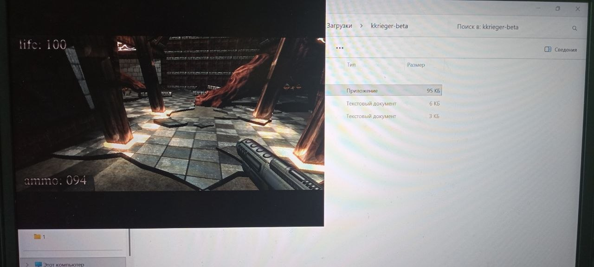

#  BUG: Игра не открывается после сворачивания

##  Описание
После сворачивания игры(ALT+TAB) игра больше не открывается. Так же зависает курсор, и им
невозможно двигать. 

---

##  Окружение
- ОС: Windows 11
- Версия игры: .kkrieger (Beta)
- Режим запуска: (обычный / совместимость / админ)
- Устройство: PC

---

##  Шаги воспроизведения
1. Запустить игру
2. Перейти в игровой мир
3. Нажать ALT+TAB
4. Вернуться на рабочий стол
5. Нажать ALT+TAB
6. Выбрать игру в списке

---

##  Фактический результат
Что происходит на самом деле:
- Игра некорректно сворачивается при ALT+TAB, осле чего ее обратно невозможно открыть.
- Так же зависает курсор мышки

---

##  Ожидаемый результат
Как должно быть по логике:
- Игра сворачивается при ALT+TAB, курсор работает нормально, игра обратно разворачивается при ALT+TAB

---

##  Частота воспроизведения
- [ ] Всегда (100%)

---

##  Severity (серьёзность)
- [ ] Critical (блокирует игру)

---

##  Вложения
- 
- Видео (если есть): ...

---

##  Дополнительная информация
  Необходим фикс сворачивания игры.