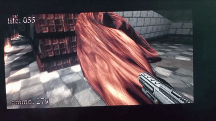
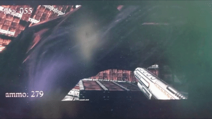
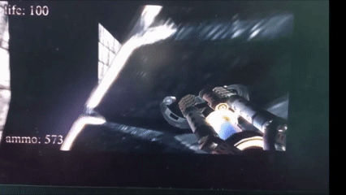

#  BUG: Провал в текстуры

##  Описание
Игрок проваливается в текстуры в некоторых местах, частично в них заходит.

---

##  Окружение
- ОС: Windows 11
- Версия игры: .kkrieger (Beta)
- Режим запуска: (обычный / совместимость / админ)
- Устройство: PC

---

##  Шаги воспроизведения
1. Запустить игру
2. Перейти в игровой мир
3. Подойти к указанному на скрине месту
4. Прыгнуть/пройти сквозь текстуру

---

##  Фактический результат
Что происходит на самом деле:
- Игрок частично заходит либо проваливается в текстуру

---

##  Ожидаемый результат
Как должно быть по логике:
- Игрок должен упираться в текстуру и не проходить/не проваливаться сквозь нее.
- Геодата должна работать корректно

---

##  Частота воспроизведения
- [ ] Иногда (10–50%)

---

##  Severity (серьёзность)
- [ ] Medium (частичный дефект)

---

##  Вложения
- 

- 

- 

  Видео :
- 

- 

- .mp4)

---

##  Дополнительная информация
