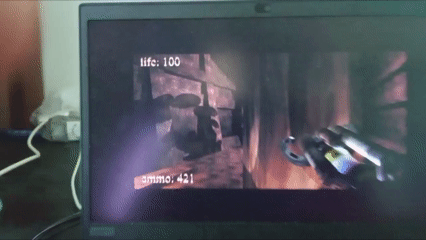
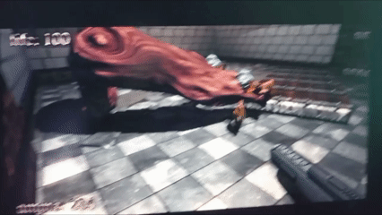
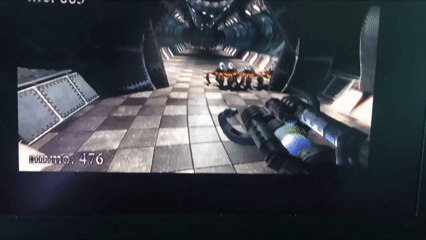
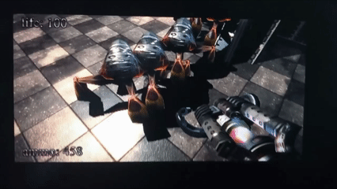

#  BUG: Моб застревает в текстуре, после чего не может двигаться

##  Описание
В локациях, где есть столбы или частичные преграды, можно завести моба к ним, после чего он
застревает и не может продолжать движение. Это дает возможнось расстреливать не рискуя

---

##  Окружение
- ОС: Windows 11
- Версия игры: .kkrieger (Beta)
- Режим запуска: (обычный / совместимость / админ)
- Устройство: PC

---

##  Шаги воспроизведения
1. Запустить игру
2. Перейти в игровой мир
3. Прийти к месту, указанному в скрине(либо к любому, где есть похожие преграды)
4. Сагрить моба стрельбой
5. Подвести его под преграду
6. Отбежать

---

##  Фактический результат
Что происходит на самом деле:
- Моб застревает в текстуре, прекращает двигаться, ем самым давая возможность игроку
  его безнаказанно расстреливать

---

##  Ожидаемый результат
Как должно быть по логике:
- Моб должен обходить преграду в виде текстуры.

---

##  Частота воспроизведения
- [ ] Иногда (10–50%)

---

##  Severity (серьёзность)
- [ ] High (сильно влияет на геймплей)

---

##  Вложения
- 
- 
- 
- 
- 
- 
- Видео:
- 
- 
- 
- 
- 
- 
- 

---

##  Дополнительная информация
- Ннобходимо доработать поведение моба и пофиксить текстурный баг, т.к это дает игроку огромное
  пространство для использования бага в своих целях