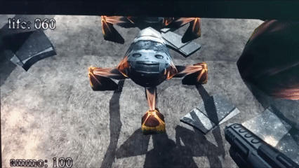

#  BUG: Отсутствие анимации атаки у мобов типа ""паук"

##  Описание
  Отсутствие нормальной анимации атаки, мобы просто стоят рядом с игроком и у него падает хп.

---

##  Окружение
- ОС: Windows 11
- Версия игры: .kkrieger (Beta)
- Режим запуска: (обычный / совместимость / админ)
- Устройство: PC

---

##  Шаги воспроизведения
1. Запустить игру
2. Перейти в игровой мир
3. Сагрить мобов
4. подождать пока подойдут
4. Наблюдать отсутствие анимации

---

##  Фактический результат
Что происходит на самом деле:
- Отсутствие анимации атаки у этого типа мобов влияет на геймплей, блокирует возможность игрока
  уворачиваться от подобных атак, так же это визуально смотрится некорректно

---

##  Ожидаемый результат
Как должно быть по логике:
- Должна быть анимация атаки моба

---

##  Частота воспроизведения
- [ ] Всегда (100%)

---

##  Severity (серьёзность)
- [ ] Low (визуальный / незначительный баг)

---

##  Вложения
- 

  
Видео:
- 

---

##  Дополнительная информация
- Необходимо добавить/починить анимацию, т.к это первые мобы, оторых встречает игрок, следовательно
 помимо неудобства геймплея это может негативно сказаться на желании игрока играть дальше.